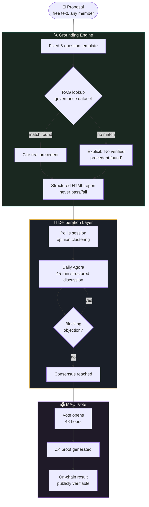
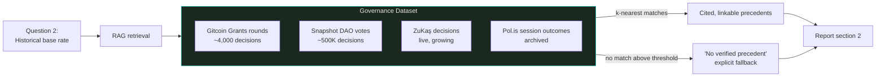
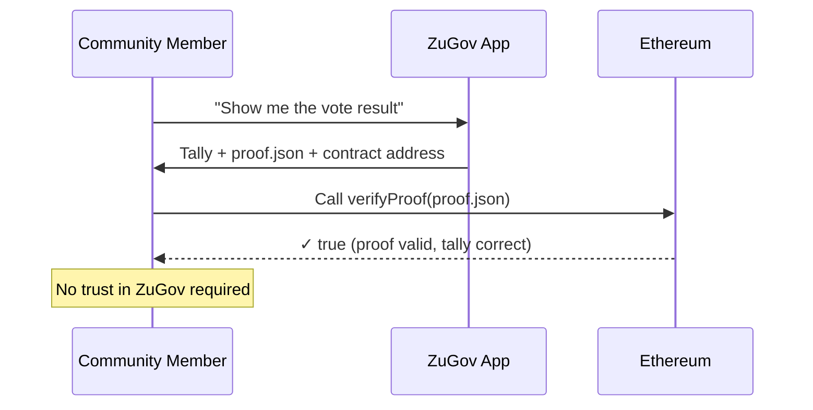

# ZuGov

**Open source epistemic governance infrastructure for emergent communities.**

Every community has the same problem: a decision needs to be made, information is scattered, interests conflict, time is short. And most of the time, a vote is held — but what happened *before* the vote? Who read what? Which questions were asked, and which were never raised?

Voting is not the problem. The epistemic process before voting is the problem.

ZuGov was built to close this gap.

---

## What It Does

ZuGov is a governance SDK for any community — DAO, popup city, municipality, cooperative. It adds a structured epistemic layer before any vote:

1. **Grounding Engine** — A pre-vote epistemic auditor. Any proposal goes in. A structured report comes out: what it assumes, what's missing, what historical base rates say. Zero voting authority. Zero veto power. Only a report.

2. **Pol.is integration** — Opinion clustering and cross-tribal consensus mapping before deliberation.

3. **MACI voting** — Minimum Anti-Collusion Infrastructure. ZK-verified, bribery-resistant voting. On-chain verifiable results.

The guarantee: *every binding decision is made after all members have had access to a structured epistemic report, through a bribery-resistant, ZK-verified voting mechanism.*

---

## The Grounding Engine — Six Questions

For every proposal, the Engine produces a structured report answering:

| # | Question | Purpose |
|---|----------|---------|
| 1 | What does this proposal assume to be true? | Surface hidden premises |
| 2 | What is the historical base rate of similar decisions? | Precedent visibility |
| 3 | Which counterarguments are absent from the proposal? | Galaxy-brain resistance |
| 4 | How reversible is this decision, and at what cost? | Decision cost awareness |
| 5 | Who is affected, and how? | Distributional impact |
| 6 | How have similar communities resolved comparable decisions? | Comparative precedent |

The output format is fixed. It cannot be modified by the proposal author. This is the galaxy-brain resistance mechanism: a structured template makes manipulation visible.

---

## Philosophy — w/acc

**Wisdom Acceleration.** As AI expands the capacity to make and execute decisions at scale, collective wisdom capacity must scale at the same rate — or the gap between decision speed and decision quality becomes catastrophic.

ZuGov does not replace human judgment. It makes collective reasoning visible before the vote happens.

The Grounding Engine is designed as *AI as interface* — Vitalik Buterin's Jan 2024 taxonomy of safe crypto+AI applications. Not *AI as rules* (dangerous: adversarial optimization). Not *AI as player* (no decision authority). A structured report that communities reason against, not a verdict they accept.

### Delegated Episteme vs. Delegated Reasoning

In February 2026, Vitalik proposed "delegated reasoning": personal AI agents trained on a user's values, handling routine DAO votes on their behalf — solving the individual participation bandwidth problem ([source](https://www.coindesk.com/web3/2026/02/21/ethereum-s-vitalik-buterin-proposes-ai-stewards-to-help-reinvent-dao-governance)).

ZuGov operates at a different level: **delegated episteme** — institutional AI that raises the quality of the *proposal* before any individual engages with it. Not "my AI votes for me" but "before any of us vote, an AI audits what we're being asked to decide."

These are complementary, not competing:
- Vitalik's agents → individual/participation layer
- ZuGov's Grounding Engine → institutional/proposal layer

A personal AI agent that reads a ZuGov Grounding Engine report before casting a vote is the natural integration of both approaches.

In March 2026, Vitalik also argued for a shift from hard binding governance mechanisms toward consensus-finding tools — surfacing broadly supported positions without enforcing them ([source](https://www.cryptotimes.io/2026/03/09/vitalik-warns-of-authoritarian-wave-calls-for-rethinking-crypto-governance/)). The Grounding Engine's zero-veto, zero-vote design is precisely this: a consensus-surface layer, not a decision layer.

### Progressive Decentralization of the AI Layer

The Grounding Engine's AI layer follows a staged decentralization roadmap — framed not as a feature but as a security commitment:

| Phase | Timeline | AI Layer | Trust Model |
|-------|----------|----------|-------------|
| Phase 1 | 0–6 months | Hosted LLM (GPT-4o / Claude) | Centralized — known risk, declared |
| Phase 2 | 7–14 months | Open-weights model, self-hosted nodes | Operator-distributed |
| Phase 3 | 15–26 months | zkML inference, on-chain verifiable | Trustless |

Phase 1's hosted LLM is a single point of failure — both technical and political. This is acknowledged explicitly. Communities deploying ZuGov in Phase 1 should understand this constraint. The roadmap exists because the constraint is unacceptable long-term, not as a marketing timeline.

---

## Architecture



---

## Decision Cycle

```mermaid
gantt
    title ZuGov Decision Cycle (7 days)
    dateFormat  D
    axisFormat Day %d

    section Epistemic
    Proposal submitted           :milestone, m1, 0, 0d
    Grounding Engine report      :active, ge, 1, 1d
    Report accessible to all     :done, ra, 1, 6d

    section Deliberation
    Pol.is session open          :pol, 2, 2d
    Daily Agora #1               :a1, 3, 1d
    Daily Agora #2 (if needed)   :a2, 4, 1d

    section Vote
    MACI vote open               :crit, vote, 5, 2d
    Vote closes + ZK proof       :milestone, m2, 7, 0d
```



---

## Base Rate Integrity — The Hallucination Problem

Question 2 of the Grounding Engine asks for historical base rates: *"What is the historical pattern for decisions like this?"*

This is the highest-risk question in the template. An LLM without external grounding will hallucinate plausible-sounding precedents. A fabricated base rate cited with confidence is worse than no base rate at all — it poisons the deliberation with false authority.

ZuGov addresses this at three levels:

### V0 — Explicit Uncertainty

The system prompt contains a hard constraint:

> *"If you do not have verified data on historical precedents, say so explicitly: 'No verified precedent found in available data. The following is a reasoning-based estimate, not an empirical finding.' Never present an inferred base rate as an empirical one."*

This does not eliminate hallucination. It makes hallucination visible. A fabricated answer labeled as a reasoning estimate is still useful for deliberation framing; a fabricated answer labeled as fact is dangerous.

### V1 — RAG over Governance Dataset



Target dataset for V1:
- **Snapshot archive** — ~500K DAO votes with metadata (passed/failed, participation rate, outcome)
- **Gitcoin Grants** — funding round decisions, reviewer reasoning
- **ZuKaş decisions** — every decision cycle documented and indexed (this is what ZuKaş produces)
- **Pol.is session archives** — bridging statements and consensus patterns

Every community that deploys ZuGov and documents their decisions contributes to this dataset. The dataset is the long-term moat — and it is a commons, not a proprietary asset.

### V2 — Verified Citation Links

Every base rate claim links to a specific, publicly accessible decision record. Not "similar DAOs have done X" but "Gitcoin Round 18, Proposal #4421 resolved this identically — [link]." The community can verify the citation before the Agora begins.

This is the difference between epistemic assistance and epistemic authority. ZuGov aims for the former. Verified citations are the technical mechanism that enforces the distinction.

---

## ZK Proof Verification

MACI produces a ZK proof for every vote. The claim: "this vote result is correct, and no individual vote was revealed." How does a non-technical community member verify this claim?

### V0 — Manual Verification

After every MACI vote, ZuGov publishes:
1. The final tally
2. The ZK proof file (`proof.json`)
3. A verification link: paste `proof.json` into a public verifier

```
Verification steps (non-technical):
1. Download proof.json from the ZuGov vote page
2. Go to: https://maci.pse.dev/verify  (or self-hosted verifier)
3. Upload proof.json
4. Verifier returns: ✓ Valid proof — tally matches
```

The critical point: **the verification step requires no trust in ZuGov**. A community member who suspects the tally was manipulated can verify independently, without asking ZuGov for anything.

### V1 — In-App Verification



The verifier is a read-only Ethereum contract call. It does not require gas. It does not require a wallet. It requires only a public RPC endpoint — which any community member can call independently.

**Why this matters for legitimacy:** A governance system that says "trust us, the vote was fair" is not a governance system. It is a trust request. ZuGov's legitimacy claim rests on the verifiability of the proof — not on the reputation of the operator.

---

## Trust Boundaries

Honest systems declare their weaknesses. ZuGov's known trust assumptions:

| Not Guaranteed | Why | Mitigation |
|----------------|-----|------------|
| Grounding Engine is always correct | LLM output can be wrong | Community can formally challenge any finding |
| Hosted LLM is censorship-resistant | Phase 1 uses centralized API — single political and technical failure point | Progressive decentralization roadmap: Phase 2 open-weights, Phase 3 zkML |
| MACI coordinator is honest | Known MACI weakness | Threshold MACI in V1 removes single coordinator |
| Sybil-proof identity | ZK alone is insufficient | Pluralistic identity: Humanode + ZK + social graph |
| Humanode availability | External dependency — if Humanode goes down, identity layer fails | Fallback identity mechanism documented in V1 roadmap |
| Perfect facilitation | Human error | Backup facilitator + session documentation |

---

## First Deployment — ZuKaş 2026

**April 10 – May 10, 2026. Kaş, Turkey.**

ZuKaş is a 30-day governance residency on the Lycian coast — the same coastline where the Lycian League built the world's first federal proportional democracy 2,400 years ago. Montesquieu read it in 1748 and wrote it into the Enlightenment. Madison read Montesquieu and wrote it into the American republic.

We are not nostalgic. We are asking: if they solved the coordination problem of their era here, what is the coordination problem of our era, and what would it look like to solve it in the same place?

Glen Weyl (creator of Quadratic Voting, RadicalxChange, the Plurality framework) in residence for one week to stress-test the governance experiments.

**This repository is the living technical record of that experiment.**

→ [zukascity.com](https://zukascity.com)

---

## Running ZuGov V0

### Requirements

- Web server (Vercel free tier sufficient)
- LLM API — GPT-4o or Claude (~$20–50/month for small communities)
- Pol.is instance (free at pol.is, or self-hosted)
- MACI deployment (requires Solidity dev, ~2 days setup)

### Minimum Human Resources

- 1 facilitator per decision cycle (no technical background required)
- 1 technical steward (MACI + deployment)
- Community: minimum 5 people

### Deploy

```bash
git clone https://github.com/tagore11/zugov
cd zugov
npm install
cp .env.example .env
# Add your LLM API key to .env
npm run dev
```

*Full deployment guide: [/docs/deploy.md](./docs/deploy.md)*

---

## Open Questions — Tested at ZuKaş

These are hypotheses, not claims. ZuKaş is the test:

1. Do decisions made with Grounding Engine reports differ measurably from decisions made without them?
2. Does a multi-model Engine (multiple LLMs, parallel reports) outperform single-model?
3. Does facilitator rotation produce better deliberation than elected facilitation?
4. In communities of 30–50 people, does MACI voting produce higher legitimacy perception than consensus hand-raising?

Results will be published as ZuKaş progresses. The data is the paper.

---

## Online Parallel Residency

Can't attend ZuKaş physically? Join the **Online Parallel Residency**.

Run the same governance experiments in your own community. Connect to the weekly sync from ZuKaş. Contribute your results to the comparative dataset.

Communities running ZuGov simultaneously produce comparative governance data — which is the data the space doesn't have yet. Every community adds to the historical base rate database. That database is the long-term value.

→ [Apply to participate](https://zukascity.com)

---

## Contributing

ZuKaş 2026 Genesis Nodes are the founding contributor community. Their participation, challenges, and findings constitute the first empirical version of ZuGov.

All contributors are credited in the first ZuGov research paper.

```
Issues      → What breaks, what's missing, what's wrong
Discussions → Governance design questions
PRs         → Code, documentation, facilitation guides
```

---

## License

MIT — free to use, fork, and deploy.

If you deploy ZuGov in your community, we'd like to know. Not to track you — to add your outcomes to the base rate database.

---

## Status

| Component | Status |
|-----------|--------|
| Grounding Engine V0 | 🟡 In development |
| Pol.is integration | 🟡 In development |
| MACI deployment | 🔴 Pre-deployment |
| Daily Agora format | ✅ Documented |
| Facilitation guide | ✅ Documented |
| Online Residency track | 🟡 Accepting interest |

*First production deployment: April 10, 2026.*

---

*ZuGov is a living protocol. This repository is updated continuously during ZuKaş 2026.*

*Built on the Lycian coast, for the coordination problems of our era.*
